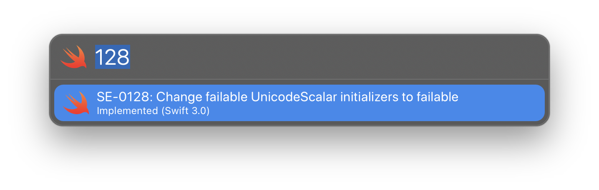
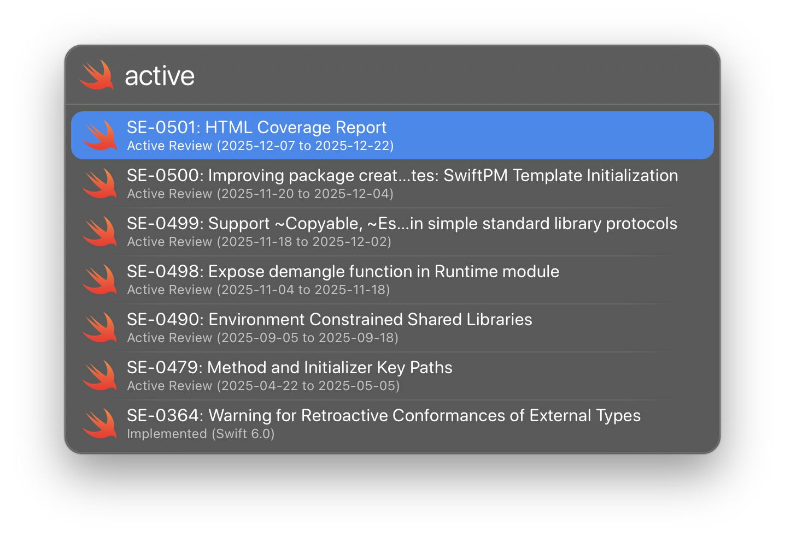
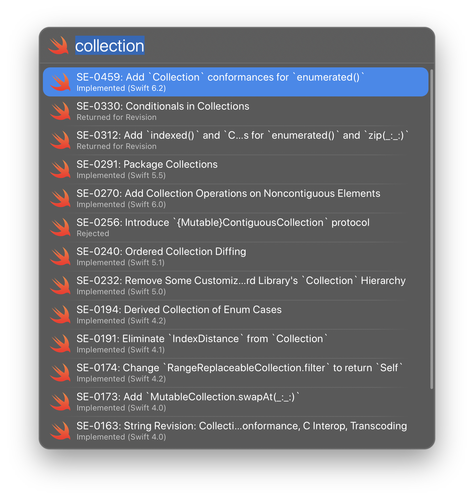

# launchbar-swift-evolution

A [LaunchBar] Action for looking up Swift evolution proposals.
Written in Swift, of course.

[Launchbar]: https://www.obdev.at/products/launchbar

## Requirements

You must have Swift 5 or newer installed (either by a version of Xcode or
Command Line Tools).

## Download

Download the latest version from the [releases page][download].

[download]: https://github.com/humblehacker/launchbar-swift-evolution/releases

## Usage

Invoke LaunchBar and type <kbd>se</kbd> followed by a space to list all proposals (more recent first). Optionally type a search string to filter results.

You can filter by proposal number:

Or by proposal status:

Or by keyword:

Available actions:

* Press Return to open the proposal in the browser.
* Hold down Command to copy the proposal title to the clipboard.
* Hold down Shift+Command to copy a Markdown link to the proposal to the clipboard.
